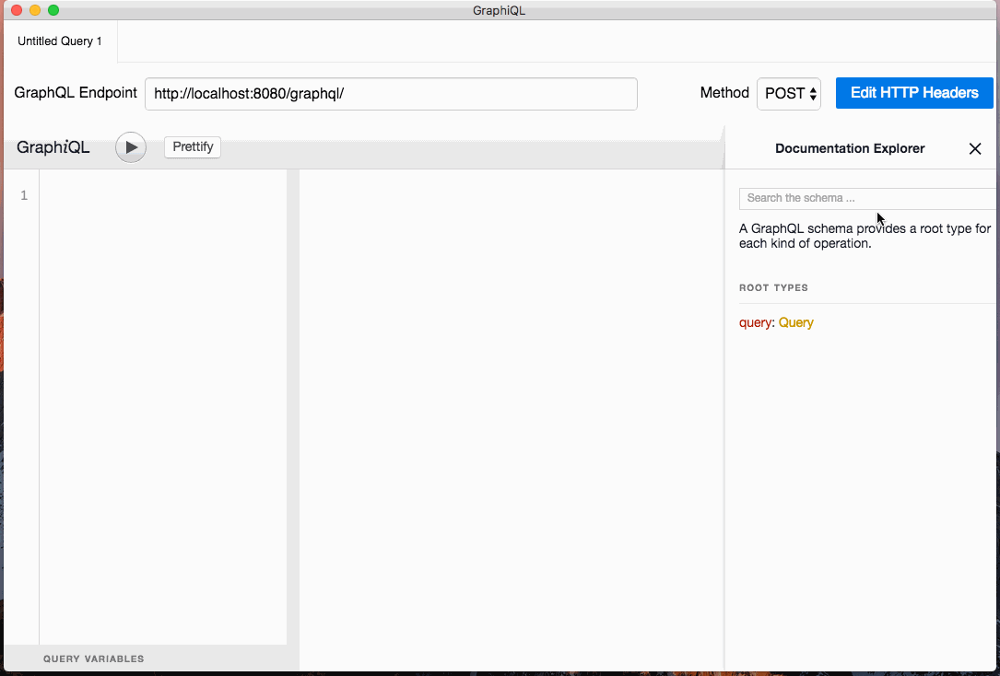

# Connecting Businesses to the Conversational economy
 Messaging Channel Portal

## Getting Set Up

Getting the server running on your local machine takes only a few steps:

1. clone the project - `git clone
2. install its dependencies - `npm install`
3. start the server - `node server.js`

## alpha testing stage

1. set up twilio account with webhook api/sms to send texts
2. curl http://localhost:3000/sms/chaos to trigger random text stream

## License and Use
 [LICENSE](LICENSE.txt).

## Contributing

We love receiving pull requests! For specifics on how to contribute to this project, check out the [contributing file](CONTRIBUTING.md).

# Movies GraphQL server

A simple node.js server for exposing a GraphQL API of movie data, backed by Neo4j. This GraphQL schema is based on a Neo4j dataset composed of movie data from [OMDb](http://www.omdbapi.com/) and [MovieLens](https://grouplens.org/datasets/movielens/).

## Run

### Neo4j

First, you'll need a Neo4j instance with the movie and review data. The easiest way to get that is to spin up a Neo4j Sandbox Recommendations use-case instance [here](https://neo4j.com/sandbox-v2). Once you've created the Neo4j Recommendations instance be sure to note the instance's host, password, and bolt port. You'll need to set these to connect to Neo4j from the GraphQL server:

Then:

1. `git clone` this repo
1. `cd movies-graphql-neo4j-server`
1. `npm install`
1. Edit `resolvers.js` and set the correct host, password, and bolt port for your Neo4j instance on line 2.
1. `npm start`

This will start the GraphQL server at `http://localhost:8080/` with the GraphQL endpoint at `/graphql` and the Graphiql query workbench at `/graphiql`. I highly recommend using Graphiql to explore the GraphQL schema.

